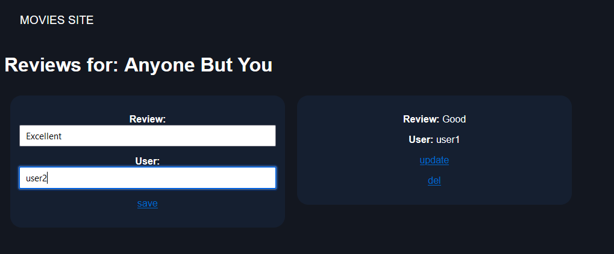

# Descripton
Node app that allows to search movie by title and write/edit/remove comments (reviews)

# Setup
### MongoDB 
1. Create .env file in **"./back"** folder. Set **"MONGO_USERNAME"** and **"MONGO_PASSWORD"**. Simply write line by line:  **MONGO_USERNAME=password** . No semicolons, commas or anything.
2. Get your **uri** connection string to MongoDB. Paste it into **"uri"** variable. Interpolate uri string with your mongodb username and password. {mongo_username} and {mongo_password} (these are variables with values from environment variables in **.env** file.

### Node
Go to **"./back"** folder in console and run app using **"node ./index.js"**
# Examples of use
### Default page / **empty** search

### Searching movies
Search bar:

Searching result:

### Adding reviews

